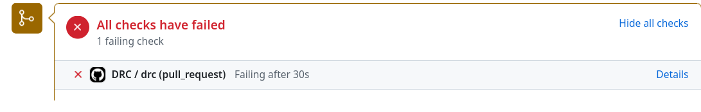
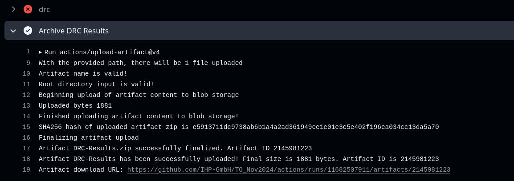
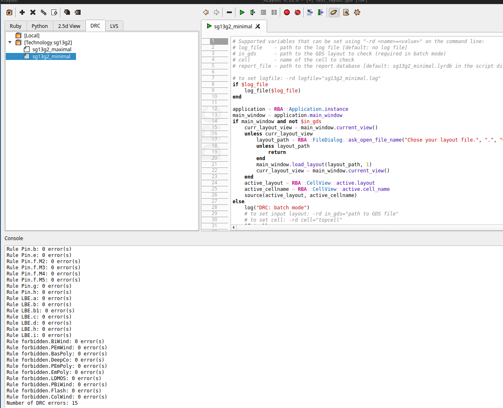

# TO_May2025

This repository is dedicated to the submission of open-source designs based on the IHP 130nm BiCMOS Open Source PDK, specifically for the April 2025 edition of the IHP OpenMPW program. In the future, this repository will be integrated as a submodule within the `IHP-Open-DesignLib` repository.

ReadTheDocs documentation for IHP-Open-DesignLib is [here](https://ihp-open-ip.readthedocs.io/en/latest/)

> [!IMPORTANT]  
> Submission deadline is **May 9**.

> [!IMPORTANT]  
> Please read carefully the `ExampleDesign/README.md` and fill metadata.json.

## Physical design constraint

1. Please align with the layout design rules which can be found [here](https://github.com/IHP-GmbH/IHP-Open-PDK/blob/main/ihp-sg13g2/libs.doc/doc/SG13G2_os_layout_rules.pdf)
2. The area granted to a community member is 2 mm^2 It includes the sealring.
3. The sealring can be found among KLayout PyCells.

## Submission process

To submit for our OpenMPW run you have to have a valid github account. 
Make a fork of this repository and then create a separate directory for your design next to the `ExampleDesign` (you can also make a copy and rename it). 
Structure your data according to our recommendations, update the documentation and push your files to your fork, then make a pull request.

> [!CAUTION]  
> On each PR a github action will be triggered to run a minimal DRC precheck (rejection test). Please consider it and do not upload many `gds` files.

Once you make a PR a github action will run a minimum set of DRC checks on each `gds` and `gds.zip` file. 
If the test passes it means that your design is manufacturable at our pilot line not ensuring the reliability. 
An example of a failure is shown on the following figure 



The detailed report can be downloaded from a link, which can be found at the end of the section `Details->Archive DRC Results` as show on the image:





> [!TIP]  
> To be sure that the design meets the minimum DRC requirements we strongly recommend to run it using klayout DRC as shown below:
>


> [!TIP]  
> The DRC rejection test supports `gds` and `gds.zip` files. In a case of a large file (> 50 MB) you can split the `zip` file and upload multiple `zip` files. On linux you can perform it using the following command:

```
zip -s 50m -r file.gds.zip output_folder/
```

## Directory structure

If you are a designer, we propose the following directory structure, which we and the community would appreciate you using. Please ensure that the design you submit is reproducible, meaning it should include all the information necessary to replicate the design.


```text
📁<design_name>
 ┣ 📁design_data
 ┃ ┗ 📁tool1/format1/step1
 ┃  ┗ data
 ┃ ┗ 📁tool2/format2/setp2
 ┃  ┗ data
 ┣ 📁doc
 ┃ ┣ 📜specification
 ┃ ┣ ...
 ┗ 📁val <- validation/verification >
 ```
The first segmentation separates the `design data` from a `documentation` and `verification/validation data`.

### Design data directory structure

The `design data` should be structured using tool/format/step specific scheme.   

Here you can find some examples:

Example1
```
  📁design_data
   ┗ 📁xschem
   ┗ 📁ngspice
   ┗ 📁klayout
   ┗ 📁drc
   ┗ 📁lvs
   ┗ 📁gds
```
Example2
```
  📁design_data
   ┗ 📁verilog
   ┗ 📁sdc
   ┗ 📁lef
   ┗ 📁gds
   ┗ 📁lib
   ┗ 📁drc
   ┗ 📁lvs
   ┗ 📁reports
   ┗ 📁log
   ```
### Documentation

In the `doc` folder the designer should provide the documentation. The best option would be any markdown language compatible with `sphinx` and thus ReadTheDocs system. It would make it easy to create a central point for documentation in the `IHP-Open-DesignLib` repository. 
We also provide a basic template for the documentation in the `ExampleDesign/doc` directory. To use it execute the following:
```
cd ExampleDesign
pip install -r requirements.txt
make docs
```
Go to `source` directory to modify the `rst` files.

### Verification/validation data

Since one of the principal goals of the OpenMPW runs is a creation of a silicon proven designs we expect from the designers to measure and validate the submitted design and then open source measurements results.
This directory at the moment of the submission is only a placeholder for future measurements data. A report from the measurements can be part of the documentation. 
