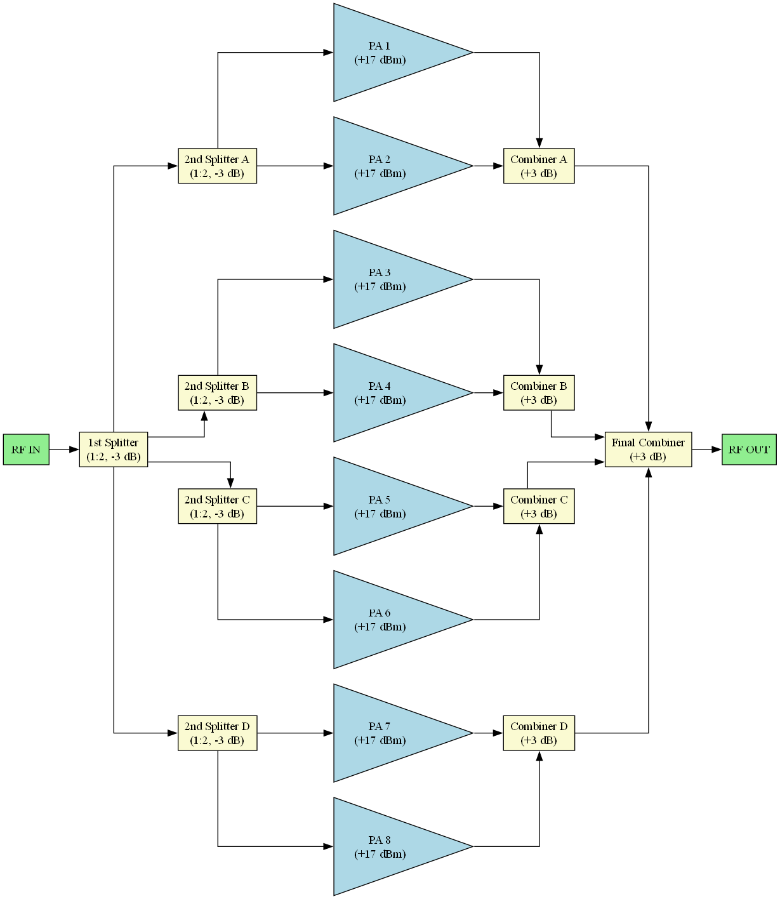
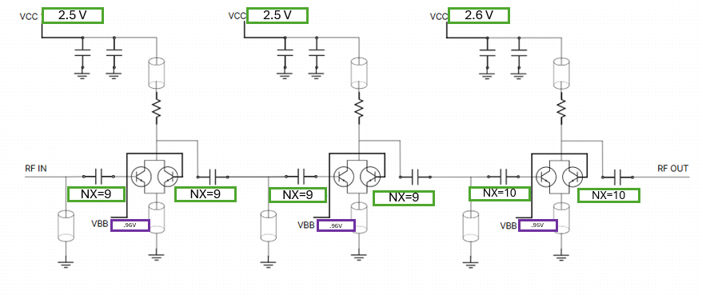

**The Eight-Way Power Amplifier**
\##############################################

Design Procedure
\##############################################

The Eight-Way Power Amplifier was developed as a high-power evolution of the Two-Way and Four-Way amplifiers, targeting an **expected Psat of \~26 dBm at 180 GHz**. The design reuses the validated **three-stage Common Emitter (CE) unit cell**, each with \~17 dBm Psat, and integrates **eight such units** through a **3-level Wilkinson splitter/combiner network**.

The design process is summarized in the following flowchart:

.. image:: \_static/8\_way\_PA\_design\_flowchart.png
\:align: center
\:width: 300
\:height: 500

The flow includes:

* Use of 8 identical CE unit cells
* Hierarchical 3-level Wilkinson structure
* Incorporation of improved choke and transmission lines
* EM simulation and layout-versus-schematic (LVS) validation

Eight-Way Power Amplifier
##############################################

Design Overview
----------------------------------------

The Eight-Way Power Amplifier was developed to achieve a **target Psat of 26 dBm at 180 GHz**, building on the CE-based unit cell validated in previous tapeouts. The amplifier scales eight such unit cells using a **three-level Wilkinson splitter-combiner network**, along with **EM-optimized chokes and transmission lines** for high-frequency performance and thermal reliability.

*Figure: Hierarchical block diagram showing 3-level Wilkinson network and 8 amplifier chains with ideal combining loss model.*

---

Unit Cell Schematic
----------------------------------------

Each amplifier core consists of a **three-stage single-ended Common Emitter (CE) chain**. The input stages are powered using **VCC = 2.5 V** and the final stage at **VCC = 2.6 V**, with appropriate **base bias voltages (VBB)** at 0.96 V and 0.95 V respectively.

The schematic below represents one unit cell used in the 8-way amplifier, showing the topology of the CE chain and the biasing architecture:

*Figure: Schematic of the three-stage CE amplifier used as a unit cell. NX denotes the number of emitter fingers per transistor.*

The unit cell is carefully designed for:
- **High Psat performance (~17 dBm)**
- **Individual bias tuning per stage**
- **Proper decoupling at each power rail**
- Inter-stage matching using MIM capacitors and transmission lines

Based on theoretical scaling, **each doubling of unit cells increases Psat by \~3 dB**. Thus:

* 1 Unit Cell: 17 dBm
* 2-Way: 20 dBm
* 4-Way: 23 dBm
* **8-Way: 26 dBm expected Psat**

## Layout Design

.. image:: \_static/eight\_way\_PA\_gds\_view\.PNG
\:align: center
\:width: 400
\:height: 450

The layout integrates:

The layout integrates:

1. Eight CE amplifier cores, arranged symmetrically

2. Three-stage Wilkinson power tree, centrally routed

3. Wide metal routing for RF and DC supply

4. EM-optimized RF choke structures: designed to suppress unwanted resonances and minimize inductive parasitics at G-band

5. Improved transmission lines: refined through layout-aware EM simulation to reduce insertion loss, maintain phase coherence, and enhance return loss matching

6. Dedicated lines for VCC1 (2.5V), VCC2 (2.6V), VBB1 (0.96V), VBB2 (0.95V)

7. Compact footprint with symmetry and thermal distribution in mind

## S-Parameter Analysis of Combiner

.. image:: \_static/Combiner\_S3P\_parameters.png
\:align: center
\:width: 1000
\:height: 500

The EM-simulated 3-port Wilkinson combiner exhibits:

* **Excellent input/output matching**: S11 = -19.2 dB, S22 = -34 dB
* **High isolation**: S12/S21/S13 all below -3.25 dB
* Return loss and isolation suitable for G-band combining

These results confirm that the Wilkinson network performs optimally at 180 GHz for 8-way power combining.

## Pad Layout

.. image:: \_static/Eight\_way\_pad\_layout.png
\:align: center
\:width: 400
\:height: 400

The pad configuration remains GSG-compatible, with updated supply levels:

* **Left Side:** VCC1 (2.5 V), GND, RF IN PAD (hexagonal), GND, VCC1 (2.5 V)
* **Right Side:** VCC2 (2.6 V), GND, RF OUT PAD (hexagonal), GND, VBB2 (0.95 V)
* **Top Center:** VBB1 (0.96 V)
* **Bottom Center:** VCC2 (0.95 V)

## Large Signal Analysis (Unit Cell)

Since full transient harmonic simulations are limited in Qucs-S, the **unit cell** performance was analyzed for Gain Compression and Psat:

Transient Response:

.. image:: \_static/transient\_run.PNG
\:align: center
\:width: 500
\:height: 300

Fourier Analysis:

.. image:: \_static/Fourier\_Transformed.PNG
\:align: center
\:width: 500
\:height: 300

Fundamental at 180 GHz dominates, with a magnitude of 2.23 indicating strong spectral purity.

Gain vs Pin:

.. image:: \_static/Gain\_vs\_Pin.png
\:align: center
\:width: 800
\:height: 400

Shows:

* Flat gain \~9.8 dB up to 10 dBm input
* Compression beyond 12 dBm
* Psat region \~17 dBm input

Pout vs Pin:

.. image:: \_static/Pout\_vs\_Pin.png
\:align: center
\:width: 800
\:height: 400

Output saturates at \~17 dBm, confirming unit cell Psat.

Expected Combined Psat (8-way): \~17 + 9 = **26 dBm**, assuming ideal addition via Wilkinson combining.

## Conclusion

This 8-way amplifier demonstrates the scalability of CE-based unit cell topology to high-output power levels at 180 GHz. Enhanced by optimized transmission lines and improved chokes, it achieves excellent spectral, layout, and theoretical performance targets in SG13G2 technology.
